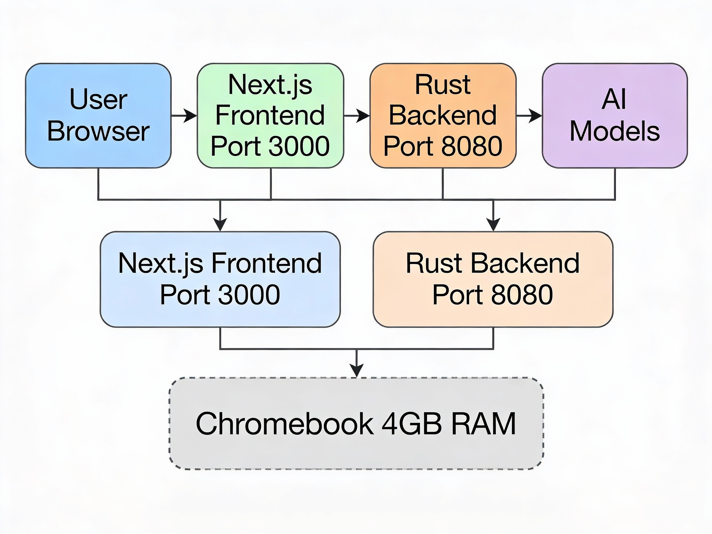

# ai-firm

**The Way to Rust** – An AI-powered development platform running on minimal hardware.

## Overview

ai-firm is a full-stack application combining a Rust backend with a Next.js frontend, designed to demonstrate professional AI agent deployment on resource-constrained systems like Chromebooks.

## 🚀 Live Demo

> **Note**: Demo deployment coming soon. Currently in development.

**Planned Demo URL**: `https://ai-firm-founder-oss.vercel.app`

### Screenshots

#### Main Dashboard

*AI agent interface showing real-time processing on 4GB Chromebook*

#### System Architecture

*Rust backend + Next.js frontend architecture*

#### Performance Metrics

*Resource usage on low-spec hardware*

## Tech Stack

- **Backend**: Rust
- **Frontend**: Next.js (React)
- **Target Environment**: 4GB RAM Chromebook (Crostini)

## Project Structure

ai-firm/
├── backend/ # Rust backend services
├── frontend/ # Next.js frontend application
└── README.md


## Setup

### Prerequisites
- Rust toolchain
- Node.js 18+
- Git

### Installation

```bash
# Clone the repository
git clone https://github.com/Founder-OSS/ai-firm.git
cd ai-firm

# Backend setup
cd backend
cargo build

# Frontend setup
cd ../frontend
npm install

# Start backend
cd backend
cargo run

# Start frontend (new terminal)
cd frontend
npm run dev


